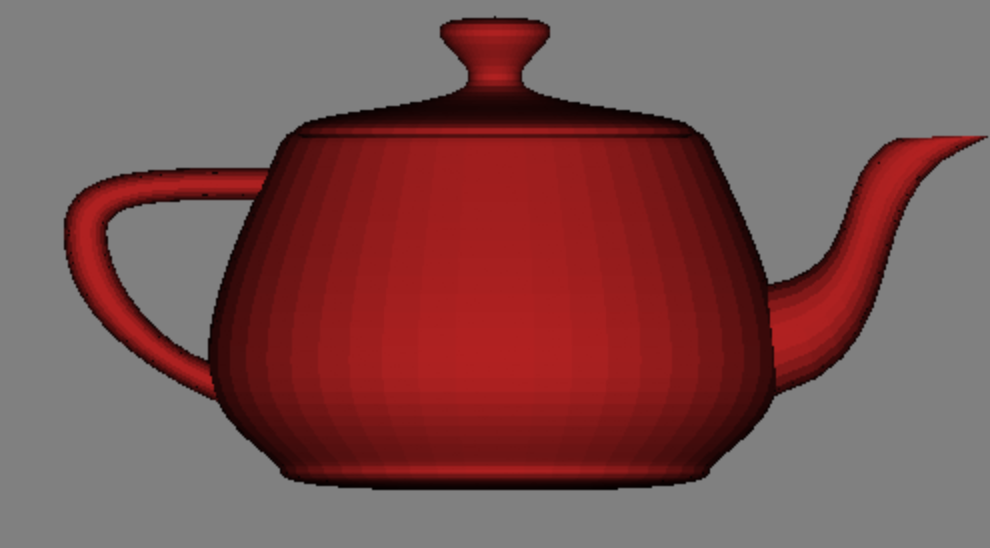

# A Toy Software Renderer

## Dependencies

This is a very simple CMake project. The Makefile at the project root has tasks to make development easier. The Makefile does assume you have `cmake` and `ninja` installed on your host.

## Build

* `make sync` ensures that the right sub-module dependencies are pulled in.
* `make run` runs the demo application.
