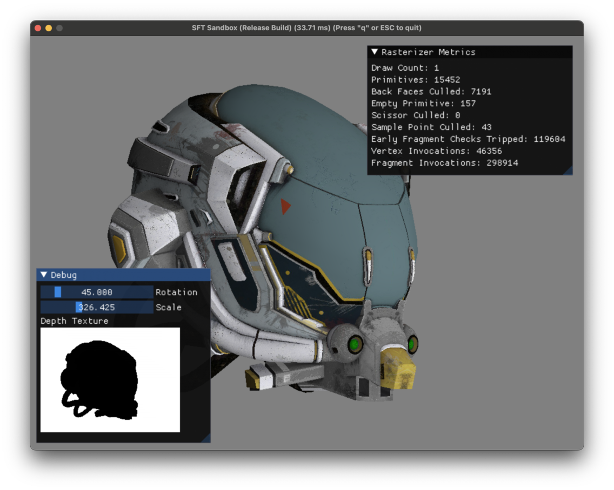
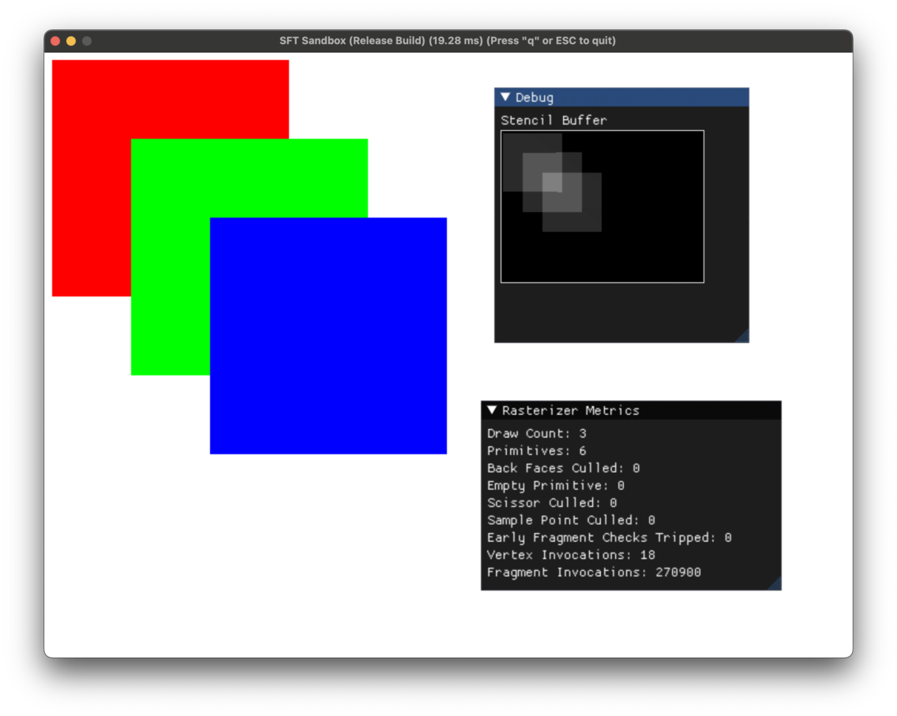
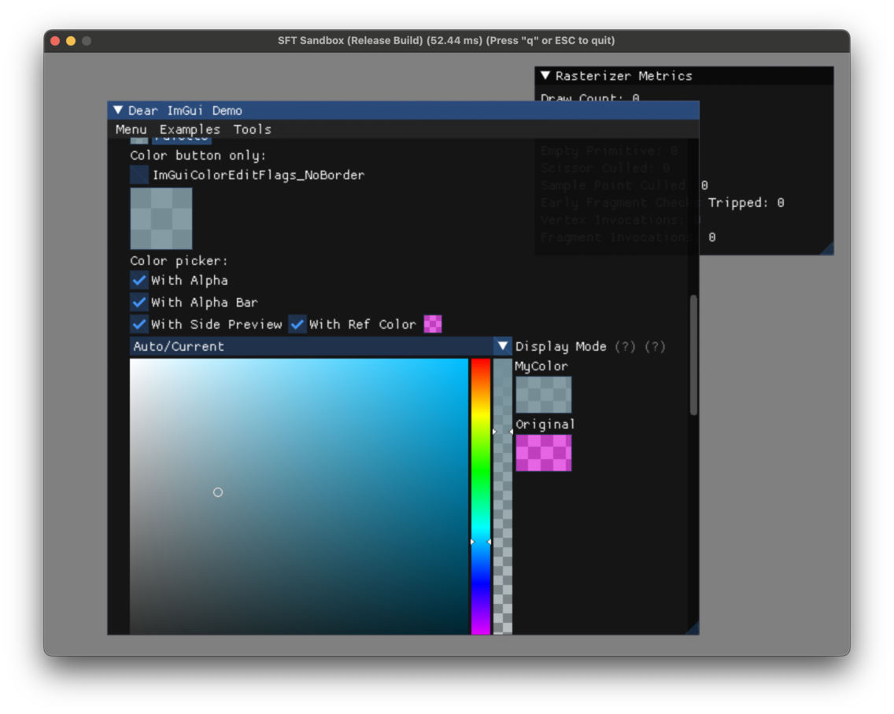
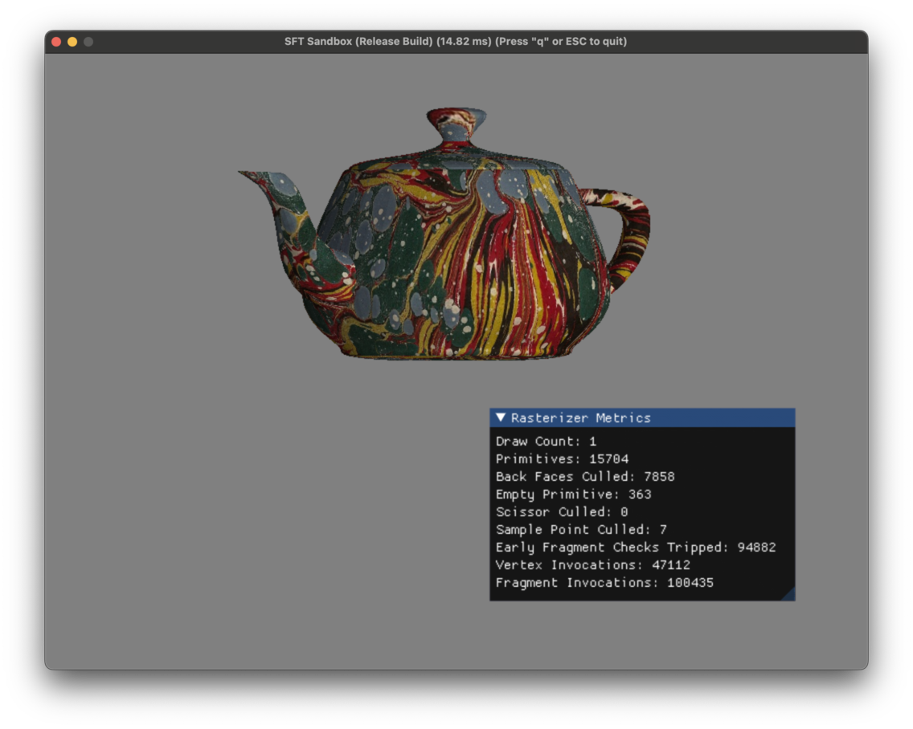
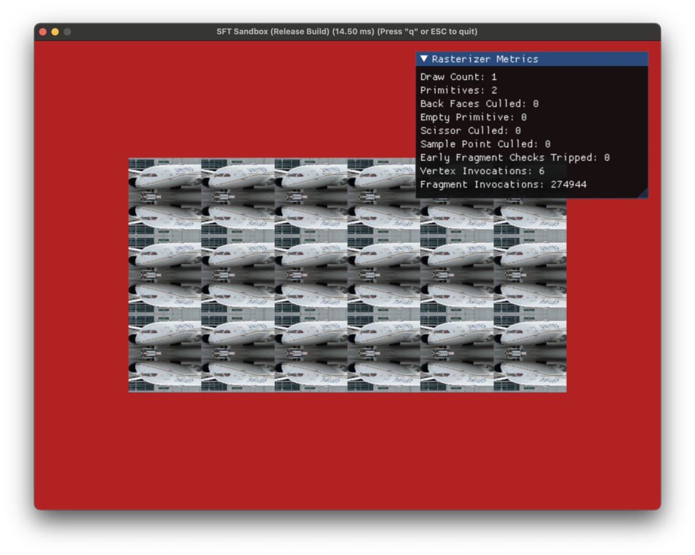
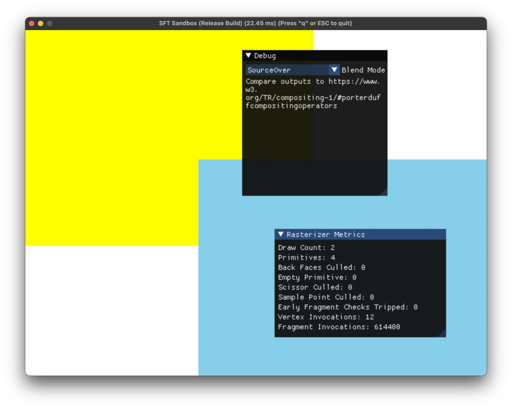

# A Software Renderer

A software renderer modelled after graphics APIs like Metal and Vulkan. A programmable shader based graphics pipeline, depth & stencil buffers, multi-sampling, tile-based-deferred-rendering, multi-core operation, blending, custom ImGUI integration, etc..

| Depth Buffers            |  Stencil Buffers           |
:-------------------------:|:---------------------------:
 |  |
| ImGUI Integration        |  Instrumentation           |
 |  |
| Texture Sampling         |  Blending                  |
 |  |

## Prerequisites

* CMake (3.22 or above).
* Git.
* Ninja.
* [Just](https://just.systems/), a task runner.
* A C11 and C++20 compiler.
* [vcpkg](https://vcpkg.io/en/index.html) for package management.
  * Ensure that the `VCPKG_ROOT` environment variable is present and valid.

## Build & Run

* `just sync` ensures that the right sub-module dependencies are pulled in.
* `just run` runs the demo application.
